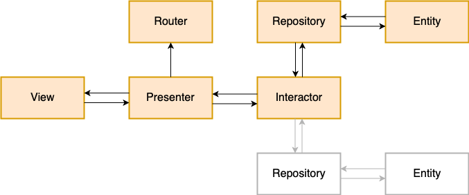

## Movie App in VIPER Architecture Example 

This repository contains a movies app which shows list of movies from The MovieDb and it's details. This app implements VIPER(View-Interactor-Presenter-Entity-Router) architecture in Android (Kotlin).

The Movie list contains 3 category of movies such as Popular,Top Rated and Upcoming Movies

## VIPER Module Diagram 

Structure of VIPER module

## Dependencies
The app is using next libraries:
- [Glide](https://github.com/bumptech/glide)
- [Retrofit](https://square.github.io/retrofit/)

## App Screenshots
     

## References
- [Android Viper]https://www.raywenderlich.com/5192-android-viper-tutorial)

If you have any suggestions or questions feel free to make a Pull Request or contact us!

## Author
#### Sunena KS
Android developer at [Astenlabs](https://www.astenlabs.com/)

